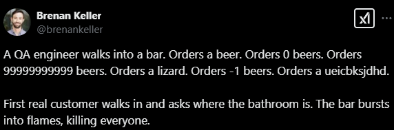

# Java Mini CLI Framework

This project provides a basic framework for building command-line interface (CLI) applications in Java. It offers a structured approach to creating interactive menus, handling user input, and managing different pages or views within your CLI application.

## Getting Started

### Prerequisites

*   Java Development Kit (JDK) installed [21]
*   IntelliJ IDEA

### Project Setup in IntelliJ IDEA

1.  Clone the repository: `git clone https://github.com/LLJY/OOP-Project`
2.  Open IntelliJ IDEA and select "Open or Import".
3.  Navigate to the cloned repository and select the `pom.xml` file.
4.  Click "Open" to import the project.

## Framework Overview

The framework consists of the following core components:

*   `UiBase`: An abstract class that serves as the base for creating UI pages.
*   `View`: An abstract class that represents a single view or page within the CLI application.
*   `Canvas`: A class responsible for rendering the UI and handling user interactions.
*   `Terminal`: A class that interacts with the console for input and output.

## Usage

1.  Create a new class that extends `UiBase`.
2.  Implement the `OnCreateView` method to define the layout and content of your view.
3.  Implement the `OnViewCreated` method to handle any initialization or setup tasks for your view.
4.  Use the `ToPage` method to navigate between different views.

## Example

Refer to the included ExampleUi, ExampleUiController and ExampleUiSecondPage for more in-depth examples and practices.

All your pages should be added as Static to Globals.Java
```java
public class MyView extends UiBase {
    @Override
    public View OnCreateView() {
        // Create UI elements here, must return a view
        
        //i.e:
        return new ListView(
                // other listview shit goes here
        );
    }

    @Override
    public void OnViewCreated(View parentView) {
        // your other code here
    }
}
```

## Contributing

Feel free to contribute to this project by submitting pull requests or reporting issues.
Refer to the styleguide [**here**](https://docs.google.com/document/d/1oQZtgl1YLNz4zDecadRudJOaQCh9SY2zP-HBpRrb8YU/edit?usp=sharing
):

## Remember this if you ever encounter an error in our app:

